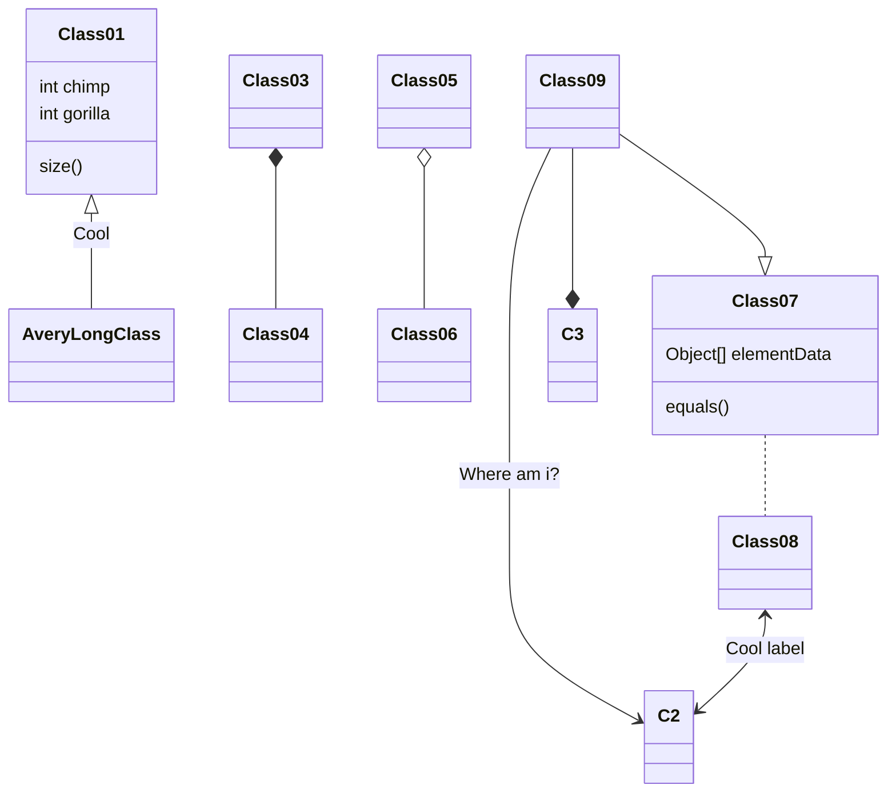

# This is how the Program Should Work

The input that we have is a dependencies/tools `.yaml`:

```yaml
dependencies:
  - python=3.8
  - numpy>1.2

tools:
  - black=1.24
  - ruff
```

This is parsed into a dictionary of type



